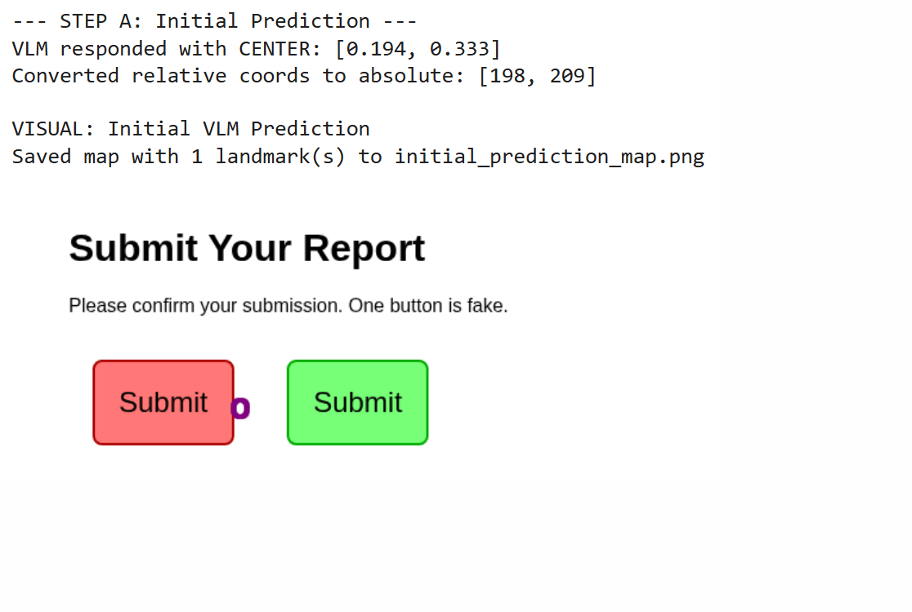
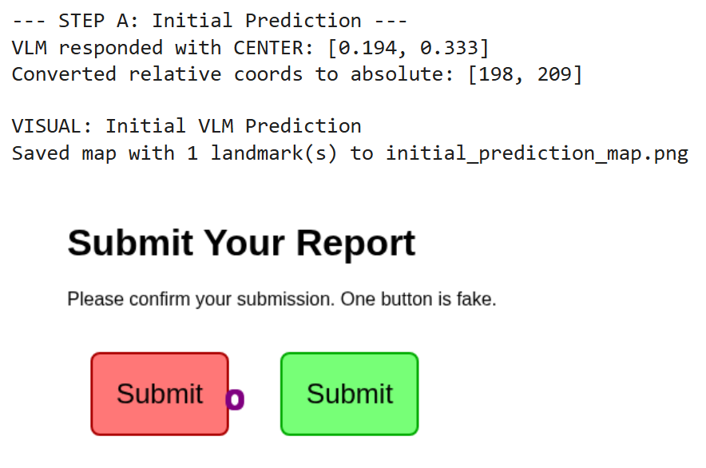
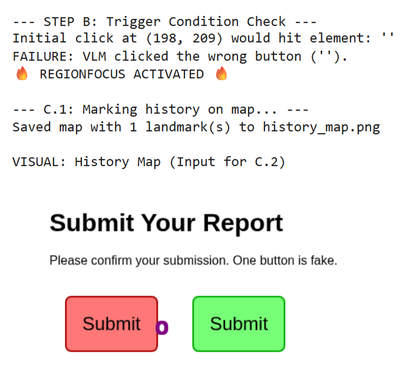
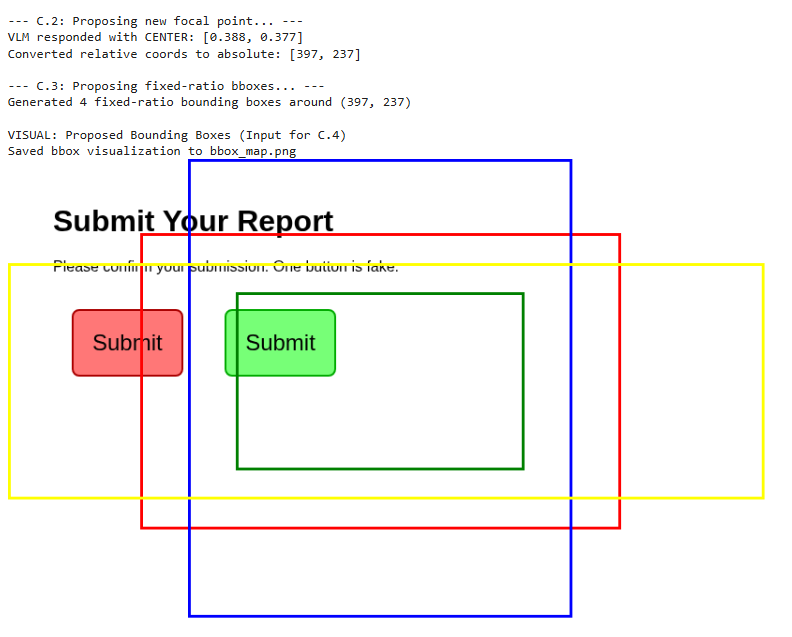
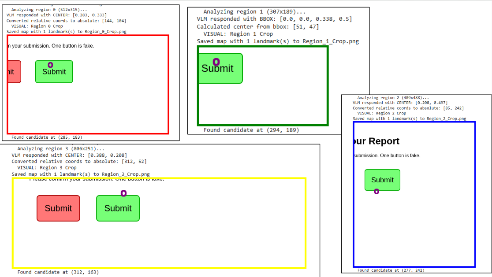
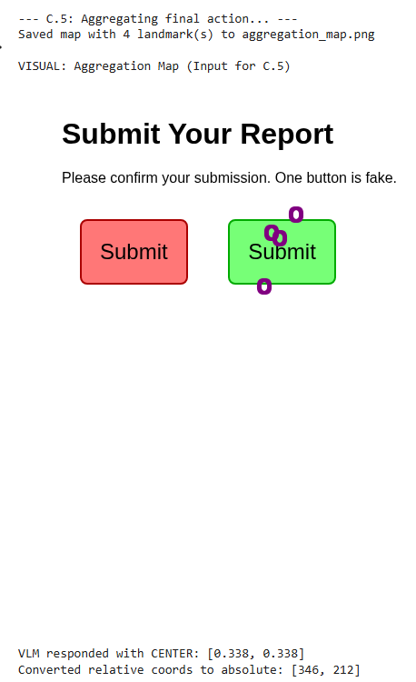
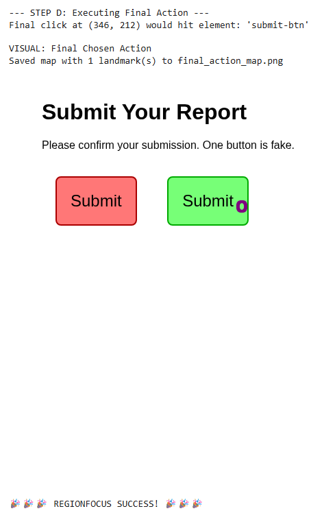

# RegionFocus-GUI-Implementation

A Python implementation of the research paper **"Visual Test-time Scaling for GUI Agent Grounding" ([arXiv:2505.00684v2](https://arxiv.org/pdf/2505.00684))**. This project replicates the core framework using a general-purpose Vision-Language Model (LLaVA) to demonstrate its effectiveness in error recovery for GUI interaction tasks.

---

## 📋 Overview

This project explores the challenge of **visual grounding** in GUIs, enabling AI agents to accurately locate UI elements based on natural language commands. The goal was to implement the **RegionFocus framework**, a training-free approach that enhances an agent's ability to recover from initial prediction errors.

The framework's core strategies are:
* **Error-Triggered Refinement:** The process activates *only* when an initial action prediction fails, saving computation on easy steps.
* **Visual Test-Time Scaling:** Dynamically "zooms in" by analyzing smaller, higher-resolution crops of the GUI around a predicted focal point.
* **Image-as-Map:** Uses visual landmarks (purple circles) directly on screenshots to represent both temporal history (avoiding repeated errors) and spatial candidates (choosing the best option).

---

## 🚀 The Experiment

This implementation, contained within a Jupyter Notebook (`RegionFocus_Implementation.ipynb`), demonstrates the full RegionFocus workflow using `Llava-1.6-vicuna-7b-hf` (quantized to 4-bit) as the VLM agent and Selenium for browser interaction.

The experiment simulates a common GUI challenge: ambiguity. A simple HTML page (`index.html`) is created with two visually identical "Submit" buttons, only one of which is correct.

1.  **Initial Prediction (and Failure):** The VLM is given the full screenshot and asked to find the correct "Submit" button. It typically makes an error, selecting the incorrect button or an empty area.
2.  **RegionFocus Activated:** The script detects the failure (simulated by checking the element ID at the clicked coordinates).
3.  **History & Refocus:** The failed coordinate is marked on a history map. The VLM uses this map to propose a *new* focal point away from the error.
4.  **Region Analysis:** Four fixed-ratio bounding boxes are generated around the focal point. The VLM analyzes crops from these regions to find candidate coordinates for the correct button.
5.  **Aggregation & Final Action:** The valid candidates are marked on an aggregation map. The VLM selects the best candidate, which is then verified.

---

## 🖼️ Results and Demonstration

The experiment successfully demonstrates the RegionFocus framework's ability to correct the VLM's initial mistake.

**GIF: Full Workflow**
*A dynamic overview showing the initial error, the triggered RegionFocus steps, and the final successful identification.*

---

### Step-by-Step Visual Breakdown:

1.  **Initial Prediction Failure:** LLaVA incorrectly identifies coordinates pointing to the *wrong* (red) "Submit" button.

    

2.  **RegionFocus: History Map:** The failed click (198, 209) is marked. This image is shown to the VLM to request a *new* focal point.

    

3.  **RegionFocus: Focal Point & BBox Proposal:** The VLM suggests a new focal point (397, 237) near the other button. Four bounding boxes are generated around it.

    

4.  **RegionFocus: Candidate Prediction (Zoom):** The VLM analyzes each cropped region.

    

5.  **RegionFocus: Action Aggregation:** The 4 valid candidate coordinates are marked on a fresh map. The VLM is asked to choose the best one.

    

6.  **Final Success:** The VLM selects coordinates (346, 212) from the aggregation map, which correctly correspond to the *right* (green) "Submit" button (`submit-btn`).

    

---

## 🔬 Analysis and Conclusion

This implementation successfully replicates the core logic and demonstrates the effectiveness of the RegionFocus framework described by Luo et al.

* **Error Recovery:** The framework clearly enables the agent to recover from an initial grounding error by leveraging visual history and focused re-examination.
* **Image-as-Map Value:** The visual landmarking proved essential for guiding the VLM away from past errors and for selecting among multiple candidates, validating the paper's findings over text-based history/aggregation.
* **VLM Adaptability:** Even with a general-purpose VLM like LLaVA 1.6 7B (which isn't specifically fine-tuned for GUIs), the framework provides a significant boost in robustness. The need to adapt the coordinate parser highlights the practical challenges of working with current LLMs/VLMs.

While the underlying VLM's capabilities still limit overall performance on highly complex GUIs, the RegionFocus framework itself provides a valuable, training-free method to improve reliability and handle ambiguity during test-time.

---

## 🔧 How to Run

1.  Clone this repository.
2.  Open `RegionFocus_Implementation.ipynb` in Google Colab.
3.  Ensure a GPU runtime is selected (Runtime -> Change runtime type -> T4 GPU).
4.  Run all cells sequentially in the notebook. The final cell executes the main workflow and displays the intermediate visual steps.